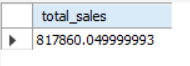
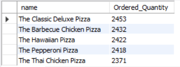
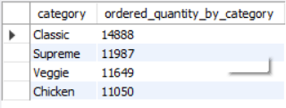
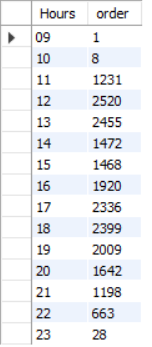
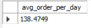
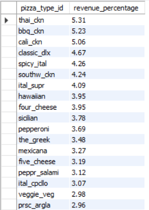
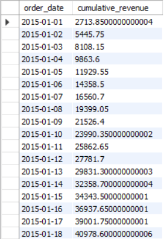
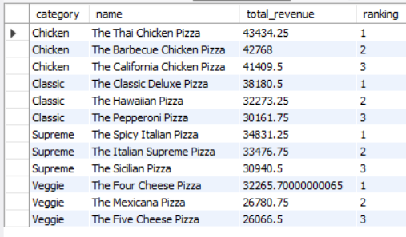

#  🍕 End-to-End Pizza Sales Analysis using MySQL & Power BI

## 📑 Table of Contents

- Project Overview
- Business Problem
- Dataset
- Tools Used
- Business Questions Solved
- SQL Concepts Demonstrated
- Key Business Insights
- Project Screenshots
- Repository Structure
- Future Improvements
- Key Learnings
- Author

---

# 📌 Project Overview

This project demonstrates an end-to-end SQL analysis of a Pizza Hut sales dataset using **MySQL**.

The objective of this project was to analyze sales performance, customer ordering behavior, product popularity, and revenue trends by answering real-world business questions using SQL.

The project covers the complete workflow from importing raw CSV files into MySQL to performing advanced business analysis using Joins, CTEs, Window Functions, Ranking Functions, Aggregate Functions, and Rolling Calculations.

---

# 🎯 Business Problem

Restaurant businesses generate large volumes of transactional data every day. However, raw data alone cannot help managers make informed business decisions.

The objective of this project is to answer important business questions such as:

- Which pizzas generate the highest revenue?
- Which pizza categories perform the best?
- What are the busiest ordering hours?
- Which pizza sizes are most preferred?
- How does revenue change over time?
- Which pizzas dominate each category?

These insights can help optimize pricing, inventory planning, marketing campaigns, staffing, and menu design.

---

# 📂 Dataset

The Pizza Sales Dataset consists of four relational tables.

### Orders
- Order ID
- Order Date
- Order Time

### Order Details
- Order Details ID
- Order ID
- Pizza ID
- Quantity

### Pizzas
- Pizza ID
- Pizza Type ID
- Size
- Price

### Pizza Types
- Pizza Name
- Category
- Ingredients

---

# 🛠️ Tools Used

- MySQL
- MySQL Workbench
- SQL
- Power BI

---

# 📊 Business Questions Solved

### Basic Analysis

- Retrieve the total number of orders placed.
- Calculate total revenue generated.
- Identify the highest-priced pizza.
- Identify the most commonly ordered pizza size.
- Find the Top 5 most ordered pizza types.
- Calculate category-wise pizza sales.
- Determine hourly order distribution.
- Analyze pizza category distribution.

### Advanced Analysis

- Calculate the average number of pizzas ordered per day.
- Determine the Top 3 pizzas based on revenue.
- Calculate the percentage contribution of each pizza type to total revenue.
- Analyze cumulative (rolling) revenue over time.
- Identify the Top 3 revenue-generating pizzas within each category.

---

# 🧠 SQL Concepts Demonstrated

## Database Operations

- CREATE DATABASE
- CREATE TABLE
- PRIMARY KEY

## SQL Fundamentals

- SELECT
- WHERE
- GROUP BY
- ORDER BY
- LIMIT

## Aggregate Functions

- COUNT()
- SUM()
- AVG()

## Joins

- INNER JOIN
- CROSS JOIN

## Advanced SQL

- Common Table Expressions (CTEs)
- Window Functions
- DENSE_RANK()
- PARTITION BY
- Rolling Aggregations

---

---

# 📊 Power BI Dashboard

After completing the SQL analysis, the cleaned dataset was visualized in **Power BI** to create an interactive business dashboard.

## Dashboard KPIs

- 💰 Total Revenue
- 📦 Total Orders
- 🍕 Total Pizzas Sold
- 💵 Average Order Value

## Dashboard Visualizations

- Revenue by Pizza Category
- Revenue by Month
- Revenue by Pizza Size
- Top 5 Pizzas by Revenue
- Revenue by Weekday

## Interactive Filters

- Pizza Category
- Pizza Size
- Month
- Date Range

The dashboard enables users to explore sales performance dynamically and derive actionable business insights.


# 📈 Key Business Insights

## 💰 Revenue Analysis

- A small number of premium pizza varieties generated a significant portion of the overall revenue.
- The Top 3 pizzas contributed substantially more revenue than the remaining menu items.

### Business Recommendation

Focus promotional campaigns around high-performing pizzas while using bundle offers to increase sales of lower-performing products.

---

## 🍕 Customer Ordering Behaviour

- Large-sized pizzas were among the most frequently ordered products.
- Customers showed clear preferences for specific pizza varieties over others.

### Business Recommendation

Maintain sufficient inventory for popular pizza sizes and best-selling pizzas during peak business hours.

---

## 📊 Category Performance

- Certain pizza categories consistently outperformed others in terms of total sales.
- Some categories relied heavily on only one or two best-selling products.

### Business Recommendation

Introduce new menu items or promotional offers in underperforming categories to balance sales.

---

## ⏰ Peak Ordering Hours

- Customer orders were concentrated during lunch and dinner hours.
- Order volume varied significantly throughout the day.

### Business Recommendation

Schedule additional kitchen staff during peak ordering hours to reduce waiting times and improve customer satisfaction.

---

## 📅 Revenue Trend

- Rolling revenue analysis showed a steady increase in cumulative revenue over time.
- Daily sales fluctuations indicate varying customer demand across different dates.

### Business Recommendation

Use historical sales trends to improve demand forecasting and inventory management.

---

## 🏆 Product Performance

- Ranking pizzas within each category highlighted the strongest revenue-generating products.
- This analysis makes it easier to identify flagship menu items.

### Business Recommendation

Feature category leaders in advertisements while redesigning or replacing consistently underperforming pizzas.

---

# 📷 Project Screenshots

### Database Tables


---

### Total Revenue



---

### Top Ordered Pizzas



---

### Category-wise Sales



---

### Hourly Order Distribution



---

### Average Daily Orders



---

### Revenue Contribution



---

### Rolling Revenue



---

### Category Ranking



## Power BI Dashboard

### Executive Dashboard


---

# 📁 Repository Structure

```
SQL-End-to-End-Pizza-Sales-Analysis
│
├── README.md
├── LICENSE
│
├── Dataset
│   ├── orders.csv
│   ├── order_details.csv
│   ├── pizzas.csv
│   └── pizza_types.csv
│
├── SQL Scripts
│   ├── 01_Database_Setup.sql
│   ├── 02_Basic_Analysis.sql
│   └── 03_Advanced_Analysis.sql
│
└── Screenshots
    ├── 01_database_tables.png
    ├── 02_total_revenue.png
    ├── 03_top_pizzas.png
    ├── 04_category_sales.png
    ├── 05_hourly_orders.png
    ├── 06_average_daily_orders.png
    ├── 07_revenue_percentage.png
    ├── 08_rolling_revenue.png
    └── 09_category_ranking.png
```

---

# 🚀 Future Improvements

- Build an interactive Power BI dashboard.
- Create KPI-based executive dashboards.
- Perform customer segmentation using Python.
- Forecast pizza sales using Machine Learning models.
- Build a complete SQL → Python → Power BI analytics pipeline.

---

# 💡 Key Learnings

Through this project, I strengthened my understanding of:

- SQL Query Writing
- Relational Database Design
- SQL Joins
- Aggregate Functions
- Window Functions
- Common Table Expressions (CTEs)
- Revenue Analysis
- Rolling Calculations
- Ranking Functions
- Business-Oriented SQL Analysis

---

# 👨‍💻 Author

**Shravan Kundap**

### Connect with me

- LinkedIn: https://www.linkedin.com/in/shravan-kundap-803a97292
- GitHub: https://github.com/ShravanK45

---

⭐ If you found this project useful, consider giving it a star!
